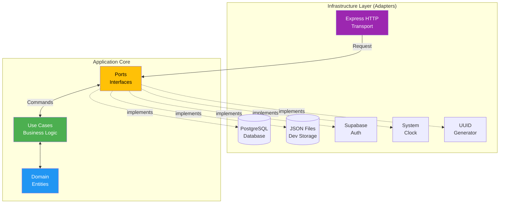
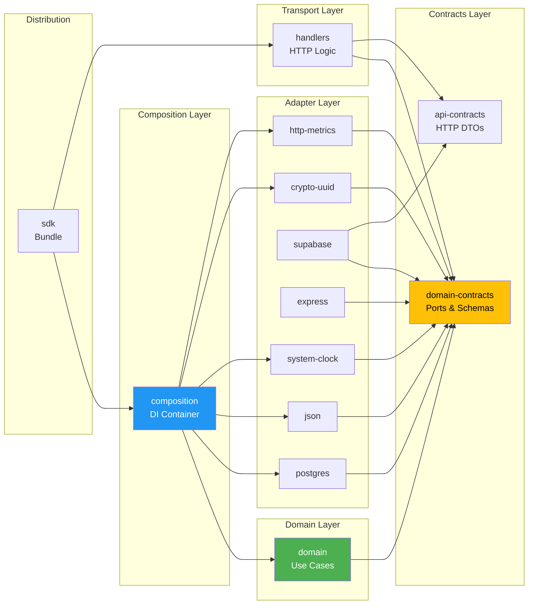
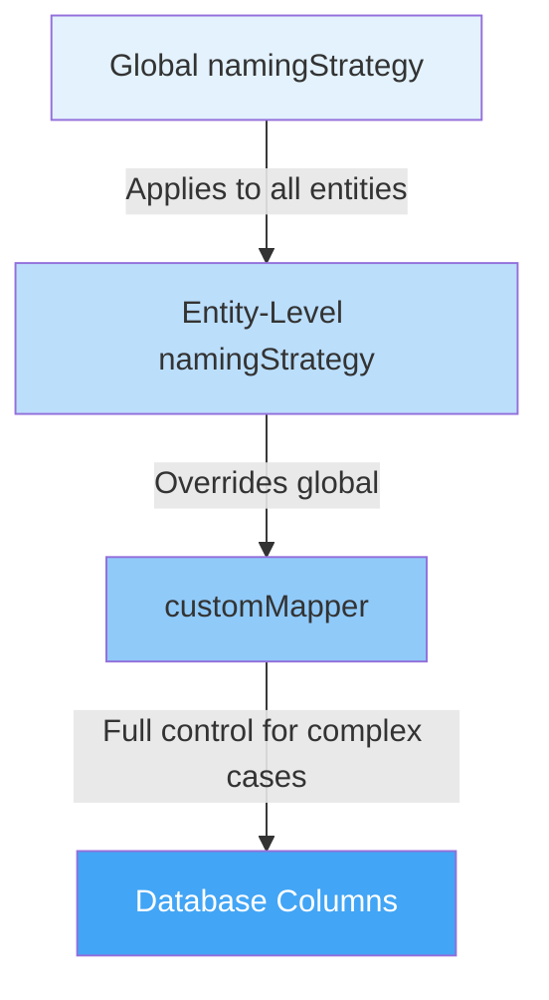
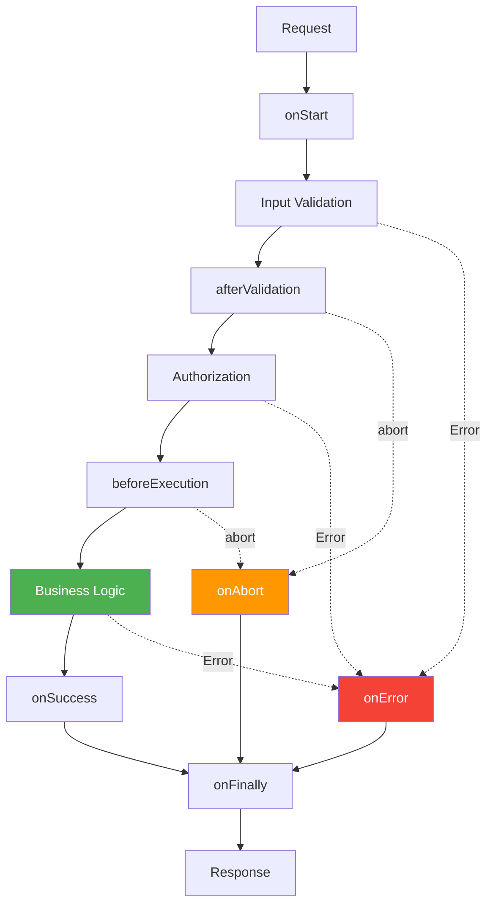

Building a multi-tenant SaaS framework is not just about writing code that works—it's about creating a foundation that's maintainable, testable, and adaptable to diverse infrastructure requirements. In this deep dive, we'll explore the architectural decisions behind MultiTenantKit and why we chose hexagonal architecture as our foundation.

## Why Architecture Matters in Multi-Tenant Systems

Multi-tenant systems face unique challenges:

- **Diverse Infrastructure Needs**: One team uses PostgreSQL with Auth0, another uses MongoDB with Cognito
- **Evolving Requirements**: Business logic must remain stable while infrastructure changes
- **Testing Complexity**: Unit testing should not require spinning up databases or auth providers
- **Team Collaboration**: Domain experts and infrastructure specialists need clear boundaries

The wrong architecture leads to tightly coupled code where changing your database requires rewriting business logic, or where testing a simple use case requires a full infrastructure stack.

**We needed an architecture that makes the hard things easy.**

## The Hexagonal Architecture Pattern

Hexagonal Architecture, also known as Ports and Adapters, was introduced by Alistair Cockburn. The core insight is simple but powerful: **the domain (business logic) should be at the center, isolated from all external concerns**.



### The Three Layers

**1. Application Core (The Hexagon)**

This is where your business logic lives. In MultiTenantKit, this includes:

- **Domain Entities**: `User`, `Organization`, `OrganizationMembership`
- **Use Cases**: `CreateUser`, `TransferOrganizationOwnership`, `AddOrganizationMember`
- **Business Rules**: Role validation, ownership transfer logic, soft delete workflows

The core has **zero dependencies** on infrastructure. It doesn't know about PostgreSQL, Express, or Supabase—it only knows about abstractions (ports).

**2. Ports (The Boundaries)**

Ports are interfaces that define how the core communicates with the outside world:

```typescript
// Repository port - the core needs persistence
export interface UserRepository<TCustomFields = Record<string, never>> {
  findById(id: string): Promise<User<TCustomFields> | null>;
  findByExternalId(externalId: string): Promise<User<TCustomFields> | null>;
  insert(user: User<TCustomFields>, context?: OperationContext): Promise<void>;
  update(user: User<TCustomFields>, context?: OperationContext): Promise<void>;
  delete(id: string, context?: OperationContext): Promise<void>;
}

// Clock port - the core needs current time
export interface ClockPort {
  now(): Date;
}

// UUID port - the core needs ID generation
export interface UuidPort {
  generate(): string;
}
```

Notice these are **contracts**, not implementations. The domain uses these interfaces without caring how they're implemented.

**3. Adapters (The Outside)**

Adapters are concrete implementations of ports. MultiTenantKit provides several:

- **Persistence Adapters**: `PostgresUserRepository`, `JsonUserRepository`
- **Auth Adapters**: `SupabaseAuthService`
- **Transport Adapters**: Express server with routing and middleware
- **System Adapters**: `SystemClock`, `CryptoUuid`

The beauty? **You can swap any adapter without touching business logic**. Need MySQL instead of PostgreSQL? Write a `MySQLUserRepository` that implements `UserRepository<TCustomFields>`. Done.

## The Monorepo Architecture

MultiTenantKit is organized as an npm monorepo with 16 packages across 6 architectural layers:



### Package Responsibilities

**Contracts** (`domain-contracts`, `api-contracts`)
- Single source of truth for types and interfaces
- Zod schemas for runtime validation + TypeScript types
- Repository ports, entity definitions, use case interfaces

**Domain** (`domain`)
- Pure business logic
- Use case implementations that orchestrate business rules
- Depends **only** on `domain-contracts`

**Adapters** (`adapters/*`)
- Infrastructure implementations
- Each adapter implements one or more ports from contracts
- Examples: PostgreSQL repos, Supabase auth, Express routing

**Transport** (`api/handlers`)
- HTTP request/response handling
- Validation, error mapping, response formatting
- Invokes use cases and translates results to HTTP

**Composition** (`composition`)
- Dependency injection container
- Wires together adapters and use cases
- Configuration management

**Distribution** (`bundles/*`)
- Pre-configured packages for end users
- `sdk`: All packages with peer dependencies (flexible)
- `express-starter`: Opinionated PostgreSQL + Supabase setup

## Dependency Inversion: The Secret Sauce

The key to this architecture is **dependency inversion**. Traditional layered architectures create top-down dependencies:

```
❌ Old Way (Tight Coupling):
Use Case → PostgreSQL Repository → PostgreSQL Driver
```

If you want to swap PostgreSQL for MongoDB, you have to modify the use case. That's coupling.

With dependency inversion:

```
✅ New Way (Dependency Inversion):
Use Case → Repository Interface ← PostgreSQL Repository
                                ← MongoDB Repository
```

The use case depends on an **abstraction** (interface), and adapters depend on that same abstraction. Now swapping databases means writing a new adapter—**zero changes to domain code**.

Here's how it works in practice:

```typescript
// 1. Use case receives abstractions via constructor
export class CreateUser<TUserCustomFields = {}>
    extends BaseUseCase<CreateUserInput & TUserCustomFields, CreateUserOutput>
{
  constructor(
    adapters: Adapters<TUserCustomFields>,
    toolkitOptions?: ToolkitOptions<TUserCustomFields>
  ) {
    super('user-createUser', adapters, toolkitOptions, inputSchema, outputSchema);
  }

  protected async executeBusinessLogic(
    input: CreateUserInput & TUserCustomFields,
    context: OperationContext
  ): Promise<Result<CreateUserOutput, DomainError>> {
    // Business logic uses interfaces, not concrete classes
    const userId = input.id ?? this.adapters.system.uuid.generate();
    const now = this.adapters.system.clock.now();

    const user: User & TUserCustomFields = {
      ...input,
      id: userId,
      externalId: input.externalId ?? userId,
      createdAt: now,
      updatedAt: now
    };

    // Persist using Unit of Work (transaction)
    await this.adapters.persistence.uow.transaction(async (repos) => {
      await repos.users.insert(user, context);
    });

    return Result.ok(user);
  }
}

// 2. Composition layer injects concrete implementations
const adapters: Adapters = {
  persistence: {
    userRepository: new PostgresUserRepository(sql, toolkitOptions), // or JsonUserRepository!
    uow: new PostgresUnitOfWork(sql, toolkitOptions)
  },
  system: {
    clock: new SystemClock(),
    uuid: new CryptoUuid()
  }
};

const createUserUseCase = new CreateUser(adapters, toolkitOptions);
```

The use case has **no idea** whether it's talking to PostgreSQL, JSON files, or MongoDB. It just knows the contract.

## Type Safety with Zod Schemas

MultiTenantKit uses Zod as the single source of truth for:
1. TypeScript compile-time types
2. Runtime validation
3. API request/response schemas

```typescript
// Define once in domain-contracts
export const UserSchema = z.object({
  id: z.string().uuid(),
  externalId: z.string().min(1),
  createdAt: z.date(),
  updatedAt: z.date(),
  deletedAt: z.date().optional()
});

// TypeScript type inference
export type User<TCustomFields = Record<string, never>> =
  z.infer<typeof UserSchema> & TCustomFields;

// API contract derives from domain
export const CreateUserRequestSchema = z.object({
  body: UserSchema.pick({ externalId: true }).extend({
    // API-specific fields
  })
});
```

One schema definition flows through the entire stack:
- **Domain layer**: Entity validation
- **Repository layer**: Database mapping
- **Handler layer**: HTTP request validation
- **TypeScript**: Compile-time type checking

Changes propagate automatically. Add a field to `UserSchema`, and TypeScript will alert you everywhere that needs updating.

## The Custom Fields System: Three-Tier Configuration

One of MultiTenantKit's most powerful features is the ability to extend entities with custom fields. We designed a three-tier configuration system that balances simplicity and flexibility.



### Tier 1: Global namingStrategy (95% of use cases)

Most projects use consistent naming across all entities:
```typescript
const useCases = createUseCases(adapters, {
  namingStrategy: 'snake_case', // ONE line for everything!

  users: {
    customFields: {
      customSchema: z.object({
        firstName: z.string(),
        lastName: z.string()
      })
    }
  }
});

// DB columns: first_name, last_name ✅
```

**75% less boilerplate** than requiring mappers for every field.

### Tier 2: Entity-Level Override

Need different naming for one entity?

```typescript
const useCases = createUseCases(adapters, {
  namingStrategy: 'snake_case', // Global default

  users: {
    database: {
      namingStrategy: 'kebab-case' // Override for users only
    },
    customFields: {
      customSchema: z.object({ firstName: z.string() })
    }
  }
});

// User DB columns: first-name ✅
// Other entities: snake_case ✅
```

### Tier 3: customMapper (Complex Logic)

Full control when you need it:

```typescript
const useCases = createUseCases(adapters, {
  users: {
    customFields: {
      customSchema: z.object({
        firstName: z.string(),
        lastName: z.string(),
        phoneNumber: z.string().optional()
      }),

      customMapper: {
        toDb: (fields) => ({
          full_name: `${fields.firstName} ${fields.lastName}`,
          phone: fields.phoneNumber
        }),
        toDomain: (dbRow) => ({
          firstName: dbRow.full_name?.split(' ')[0] || '',
          lastName: dbRow.full_name?.split(' ')[1] || '',
          phoneNumber: dbRow.phone
        })
      }
    }
  }
});
```

This three-tier approach means:
- Simple cases stay simple (tier 1)
- Moderate customization is straightforward (tier 2)
- Complex scenarios are still possible (tier 3)

## Extensibility Without Modification: The Hook System

How do you allow customization without letting users modify framework code? **Use case hooks**.

MultiTenantKit provides 7 lifecycle hooks that let you inject custom logic at precise points:



### Real-World Hook Examples

**Sending Welcome Emails**:
```typescript
useCaseHooks: {
  CreateUser: {
    onSuccess: async ({ output }) => {
      await emailService.sendWelcome({
        to: output.email,
        name: `${output.firstName} ${output.lastName}`
      });
    }
  }
}
```

**Rate Limiting**:
```typescript
useCaseHooks: {
  CreateOrganization: {
    onStart: async ({ context, abort }) => {
      const count = await redis.get(`org_count:${context.actorUserId}`);
      if (parseInt(count || '0') > 5) {
        abort('Maximum organization limit reached');
        return;
      }
    }
  }
}
```

The hooks system gives you **surgical precision** for customization without littering the domain layer with conditional logic.

## Key Design Decisions

Let's examine some critical architectural decisions and their trade-offs.

### Decision 1: Monorepo vs Multi-Repo

**Choice**: npm workspaces monorepo
**Why**:
- Atomic changes across packages (contracts + domain + adapters in one PR)
- TypeScript project references enable incremental builds
- Easier to maintain consistency

**Trade-off**: More complex structure for newcomers, but tooling (npm workspaces) makes it manageable.

### Decision 2: Zod for Schemas

**Choice**: Zod over TypeScript interfaces or class-validator
**Why**:
- Single source of truth for types + validation
- Composable schemas (`.pick()`, `.omit()`, `.extend()`)
- Excellent TypeScript integration
- Runtime safety with minimal boilerplate

**Trade-off**: Learning curve for Zod API, but payoff is huge.

### Decision 3: Result Pattern Over Exceptions

**Choice**: `Result<T, E>` type for use case returns
**Why**:
- Forces explicit error handling
- Makes error cases visible in types
- Railway-oriented programming prevents uncaught exceptions

```typescript
// Use case returns Result
const result = await useCase.execute(input, context);

if (result.isSuccess) {
  const user = result.getValue();
  // TypeScript knows this is the success type
} else {
  const error = result.getError();
  // TypeScript knows this is the error type
}
```

**Trade-off**: More verbose than try/catch, but **much safer**.

### Decision 4: Generic Repositories

**Choice**: `UserRepository<TCustomFields>` generics
**Why**:
- Type safety for custom fields end-to-end
- Framework doesn't dictate your schema
- Adapters can specialize: `PostgresUserRepository<MyCustomFields>`

**Trade-off**: More complex type signatures, but IDE autocomplete makes it seamless.

### Decision 5: Composition Over Configuration

**Choice**: Explicit DI in `createUseCases()` function
**Why**:
- No magic, no reflection, no runtime surprises
- Easy to understand dependency graph
- Testable—mock any dependency by passing a different implementation

```typescript
// Testing is trivial - inject mocks
const mockUserRepo = {
  insert: vi.fn(),
  findById: vi.fn()
};

const useCase = new CreateUser({
  ...adapters,
  persistence: {
    ...adapters.persistence,
    userRepository: mockUserRepo,
  }
});

// Test without database!
```

**Trade-off**: More manual wiring, but **explicit is better than implicit**.

## The Benefits: Why This Architecture Wins

After exploring the patterns, let's talk outcomes.

### 1. Testability

**Domain tests** run in milliseconds without infrastructure:

```typescript
// No database, no HTTP, just pure logic
const mockAdapters = createMockAdapters();
const useCase = new CreateUser(mockAdapters);
const result = await useCase.execute(validInput, context);
expect(result.isSuccess).toBe(true);
```

**Integration tests** swap real adapters:

```typescript
const testSql = testDatabaseClient.getSql();
const realAdapters = {
  persistence: { uow: new PostgresUnitOfWork(testSql, toolkitOptions) },
  system: { clock: new SystemClock(), uuid: new CryptoUuid() }
};
const useCase = new CreateUser(realAdapters, toolkitOptions);
// Test with real database
```

### 2. Flexibility

Want to:
- Swap PostgreSQL for MongoDB? Write `MongoUserRepository`
- Use Fastify instead of Express? Write a Fastify adapter
- Add custom auth? Implement `AuthService`

**Zero changes to business logic.**

### 3. Maintainability

Clear boundaries mean:
- Domain experts work in `packages/domain`
- Infrastructure engineers work in `packages/adapters`
- API specialists work in `packages/api/handlers`

No stepping on each other's toes.

### 4. Developer Experience

- **Type safety**: Catch errors at compile time
- **Discoverability**: IDE autocomplete guides you
- **Explicit contracts**: No guessing what a port expects
- **Incremental builds**: TypeScript project references = fast rebuilds

## Conclusion: Architecture as an Investment

When we started MultiTenantKit, we could have taken shortcuts:
- Couple directly to PostgreSQL
- Hard-code Express assumptions
- Skip the abstraction layers

It would have been faster... initially.

But within weeks, we'd have:
- Inflexible infrastructure
- Untestable business logic
- Frustrated users wanting different databases
- Impossible-to-maintain coupling

**Good architecture is an investment.** You pay upfront in design time, and you earn dividends in:
- Faster feature development
- Easier testing
- Painless refactoring
- Happy contributors

Hexagonal architecture isn't the only way to build software, but for a framework that needs to work with **any database, any auth provider, and any web framework**, it's the right way.

We hope this deep dive helps you understand not just *how* MultiTenantKit is built, but *why*. Whether you're using MultiTenantKit or building your own systems, these patterns are battle-tested and worth considering.

---

**Want to explore the code?** Check out the [GitHub repository](https://github.com/multitenantkit/multitenantkit) and see these patterns in action.

**Questions about the architecture?** Open a [discussion](https://github.com/multitenantkit/multitenantkit/discussions) — we'd love to hear from you!
